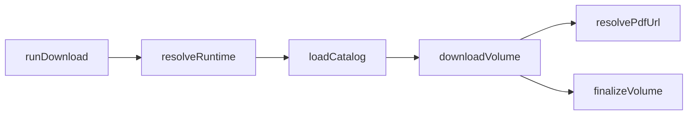

# Extend core

For site-specific work, use the **create-plugin** skill instead.

## Read first

- [docs/ARCHITECTURE.md](../../docs/ARCHITECTURE.md)
- [AGENTS.md](../../AGENTS.md)

## Module map

| Area | Path | Extend when |
|------|------|-------------|
| CLI routing | `bin/manga-downloader.js` | New top-level command |
| Args | `lib/cli/args.js` | New flags |
| Commands | `lib/commands/*.js` | New command implementation |
| Config | `lib/config/store.js`, `init.js`, `edit.js` | Schema, wizard fields |
| Runtime | `lib/shared/runtime.js` | Config+plugin resolution |
| Download | `lib/download/downloader.js` | Concurrency, skip logic |
| Output | `lib/output/registry.js`, `finalize.js` | New output formats |
| Naming | `lib/core/naming.js` | Filename patterns |
| HTTP | `lib/shared/http.js` | Retry/timeout behavior |

## Download flow

Commands call `resolveRuntime(configPath)` then delegate to domain modules. Plugins are invoked only through contract methods.

## When to change core vs plugin

| Change | Where |
|--------|-------|
| New source catalog / asset resolution | `plugins/<id>/` (HTML, API, or hybrid) |
| Image chapter support | Core: naming, downloader, paths, review, optional assemble |
| New CLI command | `lib/commands/` + `bin/` + `args.js` |
| New global output format | `lib/output/registry.js` + plugin `outputFormats` |
| Plugin-specific setup fields | Plugin `setupFields` + maybe `edit.js` |
| HTTP retry policy | `lib/config/store.js` defaults + `lib/shared/http.js` |

## Adding a command

1. Create `lib/commands/mycommand.js` exporting `runMyCommand({ cli, configPath, logger })`
2. Add command to `parseCliArgs` in `lib/cli/args.js`
3. Wire in `bin/manga-downloader.js` `main()`
4. Add `pnpm` script in `package.json` if user-facing
5. Tests in `tests/`
6. Document in `docs/COMMANDS.md`

## Adding an output format

1. Add format def to `lib/output/registry.js` (or per-plugin `outputFormats`)
2. Handle in `lib/output/finalize.js` if behavior differs
3. Update `lib/output/detect.js` if detection needed
4. Tests in `tests/output/`

## Adding image chapter support

Today core is **PDF-centric** (`buildPdfFileName`, `listPdfFiles`, merge via pdf-lib). For `chapterContentType: 'image'` plugins:

| Area | Change |
|------|--------|
| `plugins/types.js` | `chapterContentType` (already defined) |
| `lib/core/naming.js` | `buildChapterFileName` with extension from plugin |
| `lib/core/paths.js` | `listChapterFiles` by extension, not only `.pdf` |
| `lib/download/downloader.js` | Write correct extension; optional multi-fetch per chapter |
| `lib/shared/utils.js` | `chapterExists` for `.png`/`.jpg`/etc. |
| `lib/output/finalize.js` | Image→PDF assembly or CBZ (new format) |
| `lib/review/`, `lib/rename/` | Generalize beyond PDF strings |

Plugin still implements `parseSeriesPage` + `resolvePdfUrl` (asset URL). Assembly logic stays in core or a new command.

## Rules

- Do not import `plugins/<id>/scraper.js` from core
- Use `loadPlugin(config.source)` and contract methods
- Run `pnpm test` after changes
- Keep user-facing messages in Portuguese

## Reference

See [reference.md](reference.md) for hook points.
