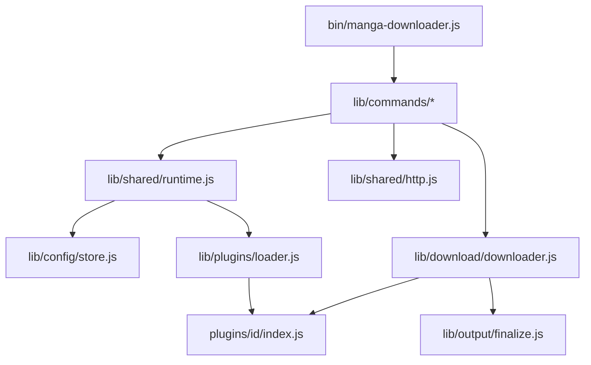
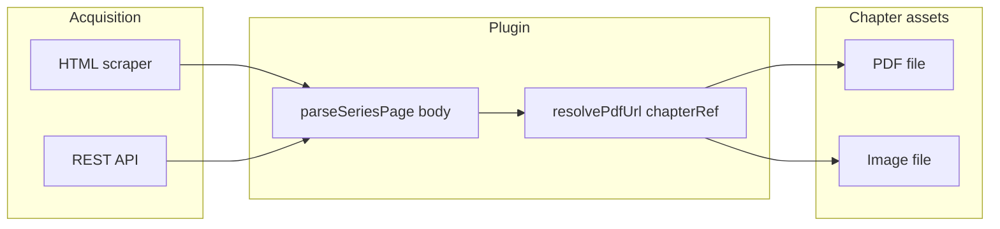
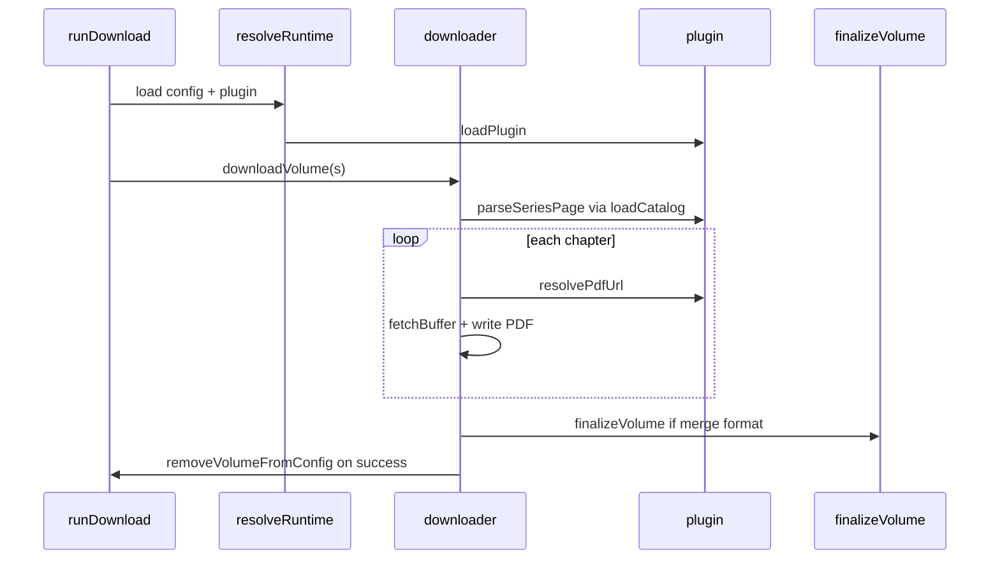

# Architecture

manga-downloader is a Node.js CLI (ES modules, no build step) for downloading light-novel chapters. Default output is PDF; plugins may target other asset types (images) with core extensions. Sources are **plugins** under `plugins/<id>/`.

## Stack

| Item | Value |
|------|-------|
| Runtime | Node.js 18+ |
| Package manager | pnpm (recommended) |
| Module system | ESM (`"type": "module"`) |
| Test runner | `node --test` |
| Key deps | cheerio, pdf-lib, @clack/prompts |

## Directory layout

```text
bin/manga-downloader.js   CLI entry (command routing)
index.js                  Thin wrapper around main()
plugins/
  types.js                SourcePlugin contract (JSDoc)
  <id>/index.js           Plugin entry (required)
lib/
  cli/                    Argument parsing
  commands/               download, review, rename, convert
  config/                 store, init wizard, edit wizard
  core/                   naming, paths, catalog helpers
  download/               Downloader orchestration
  output/                 merge, detect, finalize, format registry
  plugins/                Plugin loader/discovery
  rename/                 Kindle-style renamer
  review/                 Site vs local comparison
  shared/                 http, errors, logger, runtime, utils
  ui/                     Progress bars and prompts
tests/                    Unit/integration tests + fixtures
```

## Layer boundaries



**Rules:**

- **Source acquisition** (HTML, API, asset resolution) belongs in `plugins/`.
- **Core** (`lib/`) is source-agnostic; it calls plugin methods through the `SourcePlugin` contract.
- Commands never import plugin internals directly — only `loadPlugin(id)` and runtime helpers.

Plugins are **source adapters**. They may use HTML scraping, REST APIs, or hybrid approaches. Chapter assets may be PDF or image — see content types below.

## Plugin model



Method names are historical: `parseSeriesPage` = parse catalog; `resolvePdfUrl` = resolve asset URL. `Chapter.pdfPageUrl` = opaque chapter reference.

**Core today is PDF-centric** (`.pdf` filenames, merge, convert, review). Image plugins need core extension — see [PLUGIN_AUTHORING.md](PLUGIN_AUTHORING.md#chapter-content-types).

## Plugin lifecycle

| Phase | Module | Plugin methods |
|-------|--------|----------------|
| Discovery | `lib/plugins/loader.js` | import + `validatePlugin` |
| Init wizard | `lib/config/init.js` | `setupFields`, `enrichSetup` |
| Config edit | `lib/config/edit.js` | `enrichSetup`, `setupFields` (limited — see PLUGIN_AUTHORING.md) |
| Runtime | `lib/shared/runtime.js` | `loadPlugin`, `parseSeriesPage` via `loadCatalog` |
| Download | `lib/download/downloader.js` | `resolvePdfUrl`, `getChapterFilePatterns?` |
| Review / rename | `lib/commands/review.js`, `rename.js` | catalog + `createMatchChapter` |
| Convert | `lib/commands/convert.js` | `outputFormats` only (local files) |

Plugins are **static objects** — no `onLoad`/`onDestroy` hooks. Discovery caches plugins in memory; restart the process or call `clearPluginCache()` in tests.

## Plugin discovery

`discoverPlugins()` reads subdirectories of `plugins/` that contain `index.js`. Directories starting with `_` are skipped (scaffold/template folders).

Export shapes accepted by `validatePlugin`:

- `export default plugin`
- `export const plugin = …`
- named export object with `id`

Validation requires:

- `plugin.id === folder name`
- `name` (string)
- `setupFields` (array)
- `parseSeriesPage` (function)
- `resolvePdfUrl` (function)

## Runtime resolution

`resolveRuntime(configPath)`:

1. Reads and parses `config.json`
2. `normalizeRawConfig` — migrates legacy fields, infers `source`
3. `loadPlugin(config.source)`
4. `validateConfig(raw, { plugin })`

`loadCatalog({ config, http, plugin })`:

1. Fetches `pluginConfig.serieUrl` via HTTP client
2. Calls `plugin.parseSeriesPage(html)` → `Map<volumeKey, Chapter[]>`

## Download flow



Per volume:

1. List existing PDFs in `{pastaBase}/Vol {n}/`
2. Concurrent downloads (`config.concurrency`)
3. Skip chapters that already exist (`chapterExists` + `getChapterFilePatterns`)
4. `resolvePdfUrl` → `http.fetchBuffer` → atomic write
5. If output format is not `chapters` and no failures → `finalizeVolume` (merge)
6. On full success → volume removed from `pluginConfig.volumes`

## Output formats

Defined per plugin in `outputFormats` (or defaults to `chapters` only). Registry: `lib/output/registry.js`.

| ID | Behavior |
|----|----------|
| `chapters` | One PDF per chapter in `Vol N/` |
| `volume-single` | Merge to `{pastaBase}/{Series} - Vol NN.pdf`, keep chapter PDFs |
| `volume-single-only` | Merge and delete chapter PDFs |

`convert` command works **locally only** — no site requests.

## File naming

`lib/core/naming.js`:

- Chapters: `{Series} - Vol NN - Cap NNN.pdf` inside `Vol {n}/`
- Merged: `{Series} - Vol NN.pdf` in `pastaBase`
- Natural sort for compound cap IDs (`1-1-2` before `1-1-10`)

## HTTP client

`lib/shared/http.js` — injected into plugins via `EnrichSetupContext` and `ResolvePdfContext`:

- `fetchText`, `fetchJson`, `fetchBuffer`
- Retries with `retryDelayMs`, `maxRetries`, `requestTimeoutMs` from config
- Use `AppError` with `{ retriable: false }` for permanent failures

## Reference plugin

[`plugins/centralnovel/`](../plugins/centralnovel/) is the canonical implementation. Copy its structure when adding a new source.

## Related docs

- [PLUGIN_AUTHORING.md](PLUGIN_AUTHORING.md) — contract and checklist
- [CONFIG.md](CONFIG.md) — configuration schema
- [COMMANDS.md](COMMANDS.md) — CLI reference
